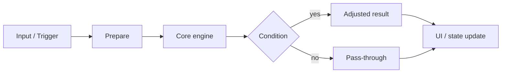

# Feature Plan Skill

Use this skill when the user asks for a feature plan, implementation plan, tech spec, design doc, or wants to think through a feature before coding.

## Goal

Produce a complete Markdown implementation plan for the requested feature using the exact team template and structure. The plan should be concise, high-signal, and grounded in the actual repository.

## Behavior

- Inspect the relevant code before writing the plan.
- Infer real files, modules, functions, components, and integration points from the repository.
- Use the exact section order and heading structure defined below.
- Do not remove sections.
- Do not invent generic placeholders if the repository gives enough context to be specific.
- If information is missing, write `TODO:` in that spot instead of deleting the section.
- Prefer short paragraphs and bullet points over long prose.
- Do not start implementing code unless the user explicitly asks for implementation.

## Output format

Return valid GitHub-Flavored Markdown using exactly this structure:

```md
***
title: "feat: <short feature name>"
status: <proposed | active | blocked | done>
created: YYYY-MM-DD
updated: YYYY-MM-DD
type: feat
depth: <shallow | medium | deep>
owner: <name or team>
labels: [<area>, <platform>, <priority>]
***

# <Feature Name>

## Summary

<What is being built, why it matters, and the desired user-visible outcome (2–4 sentences).>

***

## Problem Frame

### Current state
- <What exists today>
- <What is missing>
- <Why this is insufficient>

### User pain
- <Who is affected>
- <What they can’t do today>
- <Friction / inaccuracy / confusion>

### Why now
- <Why this matters now>
- <Product / UX / competitive / workflow reason>

***

## Goals

- <Goal 1>
- <Goal 2>
- <Goal 3>

## Non-goals

- <Explicitly out of scope>
- <Deferred adjacent capability>
- <Unchanged system / area>

***

## Requirements

- **R1.** <Functional behavior>
- **R2.** <Functional behavior>
- **R3.** <UI / UX behavior>
- **R4.** <Performance / scale>
- **R5.** <Persistence / settings / state>
- **R6.** <Accessibility / keyboard / modifiers>
- **R7.** <Default behavior>
- **R8.** <Edge cases / multi-select / group behavior>
- **R9.** <Telemetry / logging, if any>
- **R10.** <Compatibility / migration / integration>

***

## Success Criteria

- <Observable user outcome>
- <Engineering acceptance bar>
- <Performance threshold>
- <No-regression condition>

***

## Key Technical Decisions

- **<Decision title>** — <Decision summary and rationale.>
- **<Decision title>** — <Decision summary and rationale.>
- **<Decision title>** — <Decision summary and rationale.>

***

## Alternatives Considered

### Option A — <name>
- Pros: <...>
- Cons: <...>
- Rejected because: <...>

### Option B — <name>
- Pros: <...>
- Cons: <...>
- Rejected because: <...>

***

## High-Level Design

### Data flow



### Core model

```ts
type <Entity> = {
  id: string;
  // ...
};

type <Result> = {
  // ...
};
```

### Component / module architecture

```text
<Parent module> (existing)
├── <Existing piece>
├── <New piece A>
├── <New piece B>
└── <New piece C>
```

### State ownership
- <Where state lives>
- <What is persisted vs derived>
- <What is gesture-lifetime / ephemeral>

***

## UX Behavior

### Default
- <Baseline behavior>

### Active interaction
- <What appears during interaction>
- <When it shows / updates / hides>

### Temporary overrides
- <Modifier keys / toggles / shortcuts>

### Empty / edge states
- <No targets>
- <Conflicts / ambiguous cases>
- <Disabled mode>
- <Multi-selection / nested / zoom / platform quirks>

***

## Scope Boundaries

### In scope
- <Included behavior 1>
- <Included behavior 2>
- <Included behavior 3>

### Deferred
- <Follow-up 1>
- <Follow-up 2>
- <Follow-up 3>

### Out of scope
- <Explicitly excluded system / behavior>

***

## Implementation Units

### U1. <Unit name>

**Goal:** <What this unit delivers>  
**Requirements:** <R1, R2, ...>  
**Dependencies:** <None | Ux, Uy>

**Files:**
- `<path>` (new)
- `<path>` (modify)

**Approach:**
1. <Step>
2. <Step>
3. <Step>

**Patterns:** <Existing util / component / resolver to mirror>  
**Tests:** <Key scenarios>

***

### U2. <Unit name>

**Goal:** <...>  
**Requirements:** <...>  
**Dependencies:** <...>

**Files:**
- `<path>` (new / modify)

**Approach:**
1. <Step>
2. <Step>
3. <Step>

**Patterns:** <...>  
**Tests:** <...>

***

### U3. <Unit name>

**Goal:** <...>  
**Requirements:** <...>  
**Dependencies:** <...>

**Files:**
- `<path>` (new / modify)

**Approach:**
1. <Step>
2. <Step>
3. <Step>

**Patterns:** <...>  
**Tests:** <...>

***

## Testing Strategy

### Unit
- <Pure-function behavior>
- <Boundary conditions>
- <Priority / precedence rules>
- <Disabled / fallback behavior>

### Integration
- <Start → interaction → apply → cleanup>
- <State wiring / persistence>
- <Keyboard / modifier / pointer flows>

### Manual QA
- <Main happy paths>
- <Stress / scale cases>
- <Zoom / resize / multi-select / theme / platform>

### Regression
- <Existing behavior unchanged when feature is off>
- <Performance unchanged outside feature path>

***

## Performance Considerations

- <Expected complexity and hot paths>
- <Caching / precomputation strategy>
- <Potential bottlenecks and fallback>

***

## Accessibility

- <Keyboard and focus behavior>
- <Modifier-key discoverability>
- <Screen-reader impact, if any>
- <Contrast / motion / reduced-motion behavior>
- <Fallback when visual-only affordances are hidden>

***

## Persistence & Configuration

- <Stored preferences / settings>
- <Defaults>
- <Validation / bounds>
- <Migration / backward-compat notes>

```ts
type <Preferences> = {
  <key>?: <type>;
};
```

***

## Telemetry / Debugging

- <Events to log>
- <Debug flags / env toggles>
- <Dev-only overlays / logs>
- <How failures are diagnosed>

***

## Rollout Plan

### Phase 1
- <Implementation / behind-flag steps>

### Phase 2
- <Dogfood / internal QA>

### Phase 3
- <Rollout / default-on>

### Rollback
- <How to disable quickly>
- <How to recover safely>

***

## Risks & Mitigations

| Risk | Mitigation |
|------|------------|
| <Risk> | <Mitigation> |
| <Risk> | <Mitigation> |
| <Risk> | <Mitigation> |

***

## Open Questions

- <Needs product decision>
- <Needs technical validation>
- <Needs UX sign-off>

***

## Sources / References

- <Internal code / module links>
- <UX / product precedents>
- <External tools / docs used as reference>
- <Benchmarks / research>
```

## Planning protocol

When executing this skill:

1. Read the user’s feature request carefully.
2. Inspect the relevant files and nearby architecture before drafting the plan.
3. Map the feature to real code paths, state owners, UI surfaces, and extension points.
4. Fill the template with concrete repository-aware details.
5. Keep the content compact, but do not drop meaningful context.
6. If the feature is small, keep sections short rather than deleting them.
7. If the feature is large, add detail inside existing sections instead of inventing new top-level sections.

## Quality bar

A good output from this skill should:
- be immediately usable as an engineering plan,
- mention actual repo files and modules,
- separate requirements from design decisions,
- identify risks and testing needs,
- avoid vague filler,
- stay concise without losing important context.