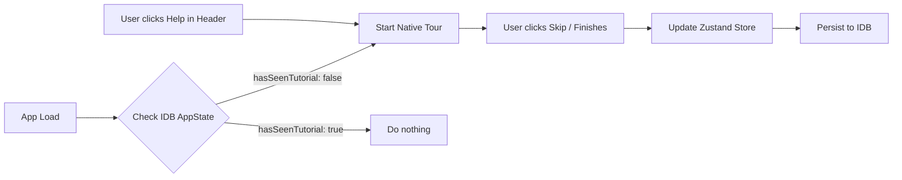

***
title: "feat: Onboarding Tutorial (Native Popover & Anchor Positioning)"
status: proposed
created: 2026-07-14
updated: 2026-07-14
type: feat
depth: medium
owner: Frontend Team
labels: [ui, ux, onboarding, performance]
***

# Onboarding Tutorial

## Summary

Introduce an interactive, tooltip-based walkthrough for first-time users using modern native web APIs (`popover="manual"` and CSS Anchor Positioning). This tutorial will guide users through the primary workflows (Setup, Inspection, and Summary), explaining key UI elements to reduce friction and improve user adoption without relying on heavy third-party libraries.

***

## Problem Frame

### Current state
- The app drops new users directly into the Setup page without explicit guidance.
- Users might not immediately understand required fields, how to flag inspection items, or where to generate the final summary.

### User pain
- First-time users may experience confusion on how to use the site.
- Lack of discoverability for features like taking photos or adding notes to flagged items.
- No easy way to recall how the app works if they haven't used it in a while.

### Why now
- As the app's functionality grows (e.g., EV vs ICE paths), it's essential to guide users so they complete the inspection accurately.
- We want to implement this using modern web standards to keep the bundle size small and maintain a premium, performant feel.

***

## Goals

- Provide an automatic interactive walkthrough on the very first visit.
- Explain the 3 main steps: Vehicle Setup, Inspection Checklist, and Summary generation.
- Allow users to easily dismiss/skip the tutorial.
- Provide a manual way to restart the tutorial via a "Help" button.
- Utilize native HTML `popover` and CSS Anchor Positioning for maximum performance and minimum dependencies.

## Non-goals

- Rebuilding a heavy, complex tooltip library from scratch (we will use simple native popovers).
- Complex multi-page routing within the tutorial (the tutorial will prompt the user to click the next tab to continue, or focus on a single page at a time).

***

## Requirements

- **R1.** The tutorial must auto-start if it's the user's first time opening the app.
- **R2.** The first-time check must be persisted locally so it doesn't bother returning users.
- **R3.** The tutorial must highlight key areas: The setup form, the navigation tabs, a checklist item (pass/flag buttons), and the export/finish button.
- **R4.** Users must be able to click "Skip" at any point to dismiss the tutorial permanently.
- **R5.** A "Help" or "Tutorial" icon in the `Header` must allow users to replay the tutorial manually.
- **R6.** The tooltips must use native `popover="manual"` and `role="dialog"`.
- **R7.** The tooltips must be tethered using CSS Anchor Positioning.
- **R8.** Programmatic focus must be routed inside the popover immediately after opening for accessibility.

***

## Success Criteria

- First-time users see the tutorial upon loading the app.
- The tutorial can be successfully dismissed and does not reappear on reload.
- The tutorial accurately points to the correct DOM elements across different screen sizes.
- No heavy third-party tooltip dependencies are added to the bundle.

***

## Key Technical Decisions

- **Use Native `popover="manual"`** — Prevents the tour step from closing accidentally during user interaction, maintaining a persistent walkthrough state.
- **Use CSS Anchor Positioning** — Tethers the tour steps to the specific features being explained natively via CSS.
- **Polyfill Fallbacks** — Include `@oddbird/popover-polyfill` and `@oddbird/css-anchor-positioning` for legacy browsers, ensuring cross-browser compatibility. Note: Polyfill requires `anchor()` instead of `position-area`.
- **Store `hasSeenTutorial` in IndexedDB** — Since we already use `idb-keyval` for `AppState`, we can easily add a boolean flag to persist the tutorial state.

***

## Alternatives Considered

### Option A — Third-Party Library (e.g., `react-joyride`)
- Pros: Provides complex step management and positioning out of the box.
- Cons: Adds significant bundle size, fights with React's rendering lifecycle, custom styling can be difficult.
- Rejected because: Modern native APIs (`popover` and anchor positioning) provide a cleaner, built-in solution for tethered overlays.

### Option B — Simple Modal on First Load
- Pros: Very easy to implement.
- Cons: Not interactive. Users tend to close modals without reading them.
- Rejected because: It doesn't actually show the user where the buttons are, failing to provide a premium onboarding experience.

***

## High-Level Design

### Data flow



### Core model

Update the existing `AppState` in `src/lib/storage.ts`:

```ts
export interface AppState {
  vehicle: VehicleInfo | null;
  items: Record<string, ChecklistItem>;
  overviewPhotos?: Record<string, string>;
  metadata?: Record<string, string>;
  hasSeenTutorial?: boolean; // New field
}
```

Update `useInspectionStore`:

```ts
interface InspectionStore extends AppState {
  // ...
  setHasSeenTutorial: (seen: boolean) => void;
}
```

### Component / module architecture

```text
src
├── components
│   ├── common
│   │   ├── Header.tsx (Add Help button)
│   │   └── TutorialPopover.tsx (New: Native popover component)
│   └── ...
├── lib
│   └── storage.ts (Update AppState)
├── store
│   └── useInspectionStore.ts (Add state & action)
└── App.tsx (Mount Tutorial logic)
```

***

## UX Behavior

### Default
- If `hasSeenTutorial` is undefined/false, the tour starts immediately after hydration.
- A sleek native tooltip (`popover="manual"`) appears and points to the Vehicle Setup form, tethered via anchor positioning.

### Active interaction
- The user clicks "Next" inside the popover to move the state to the next element. The current popover updates its `position-anchor` or hides, and the next one shows.
- The popover manages focus natively, shifting it into the dialog so assistive technologies can read it.

### Empty / edge states
- If the target element for a step is not in the DOM (e.g., pointing to a checklist while the user is on the Setup tab), the tutorial logic must programmatically switch the active tab or category to render the target. It should never show a blank screen, a loading screen, or skip the step.

***

## Scope Boundaries

### In scope
- Implementing native `popover` tooltips and CSS Anchor Positioning.
- Installing `@oddbird` polyfills.
- Persisting the state.
- Adding a Help button to the header.

### Out of scope
- Deeply nested interactive tutorials that require the user to fill out the form before continuing (we will use a standard passive tour).

***

## Implementation Units

### U1. State Management Update

**Goal:** Add `hasSeenTutorial` flag to persistence layer.  
**Requirements:** R1, R2  
**Dependencies:** None

**Files:**
- `src/lib/storage.ts` (modify)
- `src/store/useInspectionStore.ts` (modify)

**Approach:**
1. Update `AppState` interface in `storage.ts` to include `hasSeenTutorial?: boolean`.
2. In `useInspectionStore.ts`, add `hasSeenTutorial: undefined` to the initial state to prevent a hydration flash on load.
3. Add a `setHasSeenTutorial: (seen: boolean) => void` action that updates state and calls `saveAppState`.
4. Ensure `hydrateStore` properly loads `hasSeenTutorial`.

***

### U2. Tutorial Native Popover Component

**Goal:** Create the native popover container with anchor positioning and polyfills.  
**Requirements:** R3, R6, R7, R8  
**Dependencies:** U1

**Files:**
- `index.html` or `src/App.tsx` (modify)
- `src/components/common/TutorialPopover.tsx` (new)
- `src/index.css` (modify)

**Approach:**
1. Import `@oddbird/popover-polyfill` and `@oddbird/css-anchor-positioning` dynamically if browser lacks support. Wait for these to resolve before rendering the popover to prevent race-condition crashes.
2. Create `TutorialPopover.tsx` that renders a `<div popover="manual" role="dialog" aria-labelledby="tour-title">`.
3. Add an effect to call `.showPopover()` when a step becomes active, and immediately call `.focus()` on an element inside it. When the popover closes, restore focus to the previously active element.
4. Add CSS in `index.css` or component styles using `anchor()` functions for polyfill compatibility instead of `position-area`.
5. Connect it to the state to switch steps. When transitioning to a step that requires a different view (like the Inspection Checklist), the `TutorialPopover` must dispatch a state change to switch the active tab and wait for the target element to mount in the DOM *before* trying to anchor to the new element.

***

### U3. Target Wiring and Help Button

**Goal:** Add `anchor-name` to UI elements and a way to restart the tour.  
**Requirements:** R4, R5  
**Dependencies:** U2

**Files:**
- `src/components/common/Header.tsx` (modify)
- `src/components/pages/SetupPage.tsx` (modify)
- `src/index.css` (modify)

**Approach:**
1. In `Header.tsx`, add a `CircleHelp` icon button from `lucide-react`.
2. On click, it sets `hasSeenTutorial(false)` and resets the step index.
3. Add `anchor-name: --setup-form` and similar to target elements via inline style or CSS.
4. Ensure `TutorialPopover` updates its `position-anchor` variable to point to the correct `anchor-name` for the current step.

***

## Testing Strategy

### Integration
- Clear IndexedDB. Reload the app. Verify the native tour starts automatically.
- Click "Skip" / `popovertargetaction="hide"`. Reload the app. Verify the tour does NOT start.
- Click the "Help" button in the header. Verify the tour restarts.

### Manual QA
- Ensure tooltips render correctly on Firefox and Safari (where polyfills might kick in).
- Ensure the popover perfectly frames the target elements and focus is trapped/moved correctly.
- Verify that clicking outside does NOT close the popover (due to `manual` state).

***

## Performance Considerations

- Avoids the overhead of large tooltip libraries.
- Polyfills only load dynamically if native support is absent.

***

## Accessibility

- Use `role="dialog"` and `aria-labelledby`.
- Shift focus into the popover programmatically immediately upon showing.
- Ensure buttons use appropriate contrast and are fully keyboard-navigable.

***

## Telemetry / Debugging

- Log `tutorial_started` when the user sees the first step.
- Log `tutorial_skipped` if the user closes it prematurely.
- Log `tutorial_completed` if the user finishes the last step.

***

## Open Questions

- Should the popover use a mask/backdrop for the rest of the screen? Native `::backdrop` on `popover` can be styled if we want to dim the background.
