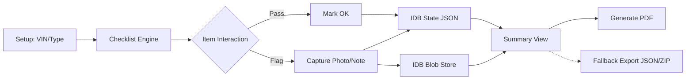

***
title: "feat: PDI Web App Core"
status: proposed
created: 2026-07-07
updated: 2026-07-07
type: feat
depth: deep
owner: Antigravity
labels: [frontend, pwa, high-priority]
***

# Pre-Delivery Inspection (PDI) Web App

## Summary

A comprehensive, offline-capable progressive web application for car buyers to perform thorough pre-delivery inspections. It enables users to document issues with photos and notes, distinguishes between EV and ICE vehicles, and generates a professional PDF report entirely on the device.

***

## Problem Frame

### Current state
- Buyers lack structured, easy-to-use tools for car inspections on delivery day.
- Relying on mental checklists, unstructured paper notes, or scattered notes apps.
- Hard to compile issues professionally to hand over to the dealership for rectification.

### User pain
- Car buyers missing critical defects before accepting delivery and signing paperwork.
- Difficulty keeping track of what was checked, what was skipped, and what needs follow-up.
- Friction in compiling photos and notes into a coherent, shareable document for the dealer.

### Why now
- Vehicle prices are at record highs, making a thorough inspection more critical than ever.
- Modern web capabilities (PWAs, on-device PDF generation, robust local storage) allow a seamless app-like experience without the friction of app store installation for a tool used infrequently.

***

## Goals

- Provide an intuitive step-by-step checklist tailored to the vehicle type (EV vs. ICE).
- Enable exception-based documentation (only force user input on flagged issues).
- Capture and attach photos directly from the mobile device camera safely.
- Generate a professional PDF report entirely client-side, programmatically to avoid memory crashes.
- Function completely offline after the initial load.
- Provide a raw data export fallback if PDF generation fails.

## Non-goals

- Cloud syncing or cross-device state sharing.
- Backend server infrastructure, user accounts, or authentication.
- Integrated car valuation, pricing negotiation, or dealership reviews.

***

## Requirements

- **R1.** Build upon a modern stack (Vite + React) with full PWA support (manifest, service worker).
- **R2.** Setup screen to collect Make, Model, VIN, and EV/ICE designation.
- **R3.** Category-based checklist navigation (Exterior, Interior, Engine/Frunk, Electronics, Documentation, EV-specific).
- **R4.** Exception-based item interaction: items default to un-checked, can be marked "Pass", or "Flagged" (triggering photo/note prompts).
- **R5.** Native device camera integration for photo attachments using HTML5 input capture, with resilient memory management.
- **R6.** Local storage (IndexedDB) for session persistence, separating application state from heavy image blobs.
- **R7.** Final summary view aggregating passed and flagged items.
- **R8.** On-device PDF generation built programmatically via `jspdf` to avoid DOM-rendering limits.
- **R9.** Warm-cream editorial canvas UI (#f7f7f4) with Cursor Orange (#f54e00) accents, using CursorGothic and JetBrains Mono, matching the provided DESIGN.md.
- **R10.** Safe fallback data export (JSON or ZIP) in case of device failure during PDF rendering.

***

## Success Criteria

- App works fully offline after initial load, behaving like a native app.
- Users can attach 20+ photos and generate a properly formatted PDF report containing those photos on both iOS and Android without OOM crashes.
- Smooth scrolling and category transitions (60fps) on mid-tier mobile devices.
- No data loss on accidental page refresh or if the browser background-suspends the tab during camera usage.

***

## Key Technical Decisions

- **Programmatic Client-Side PDF Generation** — Use `jspdf` native APIs (`doc.text`, `doc.addImage`) instead of rasterizing the entire DOM with `html2canvas`. This bypasses strict browser canvas size limits (e.g., iOS Safari) that would otherwise crash when generating multi-page reports with many photos.
- **Decoupled IndexedDB Storage** — Use `idb-keyval` but store the JSON `AppState` separately from the image files. Images will be stored as separate Blobs keyed by UUID. This prevents the browser from having to serialize/deserialize massive JSON objects on every state change, which would cause severe UI jank.
- **Memory-Safe Image Processing** — Use `createImageBitmap` for resizing camera captures instead of `canvas` to avoid Out-Of-Memory (OOM) crashes on low-end devices.

***

## Alternatives Considered

### Option A — React Native / Flutter App
- Pros: True native performance, potentially easier native camera/file system integration.
- Cons: Requires app store approval (Apple/Google), high friction for users to download an app they might only use once every few years.
- Rejected because: The web platform is now sufficient for camera capture and offline capabilities without the installation friction.

### Option B — Server-Side PDF Generation
- Pros: Simpler client logic, potentially better formatting using server-side HTML-to-PDF libraries (like Puppeteer).
- Cons: Requires backend infrastructure, hosting costs, internet connection at the dealership (often spotty), privacy concerns for uploading user photos.
- Rejected because: On-device generation is viable and guarantees privacy and offline support.

***

## High-Level Design

### Data flow



### Core model

```ts
type VehicleInfo = {
  make: string;
  model: string;
  vin: string;
  isEV: boolean;
};

type ChecklistItem = {
  id: string;
  categoryId: string;
  label: string;
  status: 'pending' | 'pass' | 'flagged';
  note?: string;
  photoId?: string; // UUID referencing the Blob in IDB, NOT base64
};

type AppState = {
  vehicle: VehicleInfo | null;
  items: Record<string, ChecklistItem>;
};
```

### Component / module architecture

```text
src/
├── components/
│   ├── ui/ (reusable buttons, inputs, modals)
│   ├── Onboarding/ (setup forms)
│   ├── CategoryNav/ (tabs for exterior/interior/etc)
│   ├── ChecklistItem/ (pass/flag toggles)
│   └── CameraCapture/ (photo input wrapper)
├── lib/
│   ├── pdfGenerator.ts (jspdf programmatic builder)
│   ├── storage.ts (IDB wrappers for State and Blobs)
│   ├── imageUtils.ts (createImageBitmap compression)
│   └── checklistData.ts (default templates)
├── store/
│   └── useInspectionStore.ts (React Context or Zustand)
└── pages/
    ├── SetupPage.tsx
    ├── InspectionPage.tsx
    └── SummaryPage.tsx
```

### State ownership
- Global state (`vehicle`, `items`) is managed via a global store (e.g., Zustand) and synced to IndexedDB on every meaningful change.
- Images are written to IndexedDB immediately upon capture/compression; the store only holds the `photoId` reference.

***

## UX Behavior

### Default
- Warm cream theme per DESIGN.md.
- All checklist items start un-checked ("pending").

### Active interaction
- Clicking "Flag" on an item slides up a drawer/modal to input a text note and open the native camera.
- Smooth transitions between checklist categories.

### Temporary overrides
- Users can switch categories at any time via a sticky top or bottom navigation bar.

### Empty / edge states
- **State Recovery:** Returning to the app detects existing state in IndexedDB and offers a prompt: "Resume existing inspection for [VIN] or start fresh?"
- **Camera OOM Recovery:** If iOS Safari kills the background tab while the native camera is open, the eager state sync ensures the checklist progress is restored when the tab reloads.
- **Error States:** If PDF generation fails, a clear error message is shown alongside a fallback "Download Raw Data" button.

***

## Scope Boundaries

### In scope
- Distinct checklist templates for EV and ICE.
- Local photo capture and note-taking with strict memory limits.
- Client-side programmatic PDF export.
- Fallback raw data export.
- PWA offline caching.

### Deferred
- Multiple concurrent vehicle inspections (history).
- Customizable checklist items.

### Out of scope
- Cloud backups or syncing.
- Integrated dealership communication.

***

## Implementation Units

### U1. Project Scaffold & UI System

**Goal:** Setup Vite, React, PWA plugin, and core CSS variables.  
**Requirements:** R1, R9  
**Dependencies:** None

**Files:**
- `index.html` (modify)
- `vite.config.ts` (modify)
- `src/index.css` (new)
- `src/App.tsx` (modify)

**Approach:**
1. Initialize Vite + React project.
2. Configure `vite-plugin-pwa` for offline service workers.
3. Set up vanilla CSS variables for the warm-cream editorial palette, Cursor Orange accents, and typography as specified in DESIGN.md.
4. Setup routing or simple state-based view rendering.

**Patterns:** Modern web design tokens, CSS variables.  
**Tests:** Verify PWA installation prompt in Chrome.

***

### U2. State Management & Storage

**Goal:** Persist inspection data and separate heavy image blobs safely.  
**Requirements:** R6  
**Dependencies:** U1

**Files:**
- `src/lib/storage.ts` (new)
- `src/store/useInspectionStore.ts` (new)

**Approach:**
1. Setup `idb-keyval` for saving/loading the lightweight `AppState` JSON.
2. Setup separate IDB wrapper functions for setting/getting/deleting image Blobs.
3. Implement `try/catch` around all IDB writes to handle `QuotaExceededError` gracefully.
4. Add a React hook to auto-sync state to IndexedDB on change.

**Patterns:** Decoupled storage for performance, graceful IDB error handling.  
**Tests:** Verify storing 10+ blobs doesn't lag the main state updates.

***

### U3. Onboarding & Checklist Data

**Goal:** Define the inspection templates and allow users to start.  
**Requirements:** R2, R3  
**Dependencies:** U2

**Files:**
- `src/pages/SetupPage.tsx` (new)
- `src/lib/checklistData.ts` (new)

**Approach:**
1. Define the static EV and ICE checklist JSON structures.
2. Build Setup screen to collect Make, Model, VIN, and EV/ICE type.
3. Dispatch "start inspection" action to populate the store.

**Patterns:** Form controlled components.  
**Tests:** Verify EV vs ICE selection loads correct categories.

***

### U4. Inspection UI & Camera Integration

**Goal:** Display checklist items and allow photo capture without OOM crashes.  
**Requirements:** R4, R5  
**Dependencies:** U3

**Files:**
- `src/pages/InspectionPage.tsx` (new)
- `src/components/ChecklistItem.tsx` (new)
- `src/lib/imageUtils.ts` (new)

**Approach:**
1. Build category navigation tabs and item cards.
2. Build modal using `<input type="file" accept="image/*" capture="environment">`.
3. Eagerly flush state to IDB right *before* the input triggers to survive potential iOS tab eviction.
4. Use `createImageBitmap({ resizeWidth: 1080 })` for memory-safe image downscaling before saving the Blob to IDB.

**Patterns:** HTML5 capture, memory-safe web APIs.  
**Tests:** Mobile browser camera invocation, memory usage profiling during capture.

***

### U5. Summary & PDF Generation

**Goal:** Review findings, generate PDF safely, and provide fallback export.  
**Requirements:** R7, R8, R10  
**Dependencies:** U4

**Files:**
- `src/pages/SummaryPage.tsx` (new)
- `src/lib/pdfGenerator.ts` (new)

**Approach:**
1. Render a summary view of flagged items fetching Blob URLs from IDB.
2. Integrate `jspdf`. Programmatically loop through flagged items, adding text (`doc.text`) and images (`doc.addImage`) sequentially, creating new pages (`doc.addPage`) as vertical space fills up.
3. Implement a fallback `Download JSON` function that bundles the state if PDF generation fails.

**Patterns:** Programmatic PDF assembly.  
**Tests:** Verify PDF generation multi-page breaking and image rendering without `html2canvas` limits.

***

## Testing Strategy

### Unit
- Checklist template filtering (EV vs ICE).
- Storage wrappers (JSON vs Blob separation).

### Integration
- Verify IDB `QuotaExceededError` triggers the correct UI alert.
- State recovery after a simulated page reload.

### Manual QA
- Test camera API access and memory usage on iOS Safari and low-end Android Chrome.
- Verify PDF multi-page layout with varying text lengths and photo aspect ratios.
- Disconnect network, refresh the page, and verify the PWA loads and state resumes.

### Regression
- Monitor main thread jank when toggling checklist items while 20+ images are stored in IDB.

***

## Performance Considerations

- **State Serialization:** By extracting images to separate Blob keys in IDB, the `AppState` JSON remains under 50KB, ensuring `JSON.stringify` on every state change takes <1ms and does not drop frames.
- **Image Processing:** `createImageBitmap` offloads decoding to a background thread, preventing UI freezes when a massive 4K image is selected from the camera roll.
- **Rendering Optimization:** Use `content-visibility: auto` on off-screen checklist items to defer rendering of long lists and heavy DOM nodes, conforming to modern web performance guidance.

***

## Accessibility

- High contrast text and clear iconography for outdoor visibility (glare at the dealership).
- Large tap targets (min 48x48px as per modern web guidelines) for checklist actions.
- Use `visually-hidden` CSS class instead of `display: none` for hiding accessible inputs.
- Focus management inside the photo/note modal.

***

## Persistence & Configuration

- `idb-keyval` stores the lightweight `AppState` JSON and independent image Blobs.
- Default to starting completely fresh if no state is found.
- Implement a cleanup routine when a new inspection is started to wipe old Blobs from IDB.

***

## Telemetry / Debugging

- Wrap PDF generation in a try/catch and log the exact failure point to a visible "Debug Log" in the UI, as offline PWAs cannot easily report errors to a server.

***

## Rollout Plan

### Phase 1
- Local development and testing on physical mobile devices on the same local network to vet memory handling.

### Phase 2
- Deploy to Vercel/Netlify for PWA testing on the public internet (requires HTTPS for Camera API to function).

### Rollback
- Client-side PWA architecture means bad deploys only affect new loads. Users mid-inspection with the site open will not be interrupted.

***

## Risks & Mitigations

| Risk | Mitigation |
|------|------------|
| Mobile browser IDB Quota Exceeded | Show an immediate blocking alert requiring user to export data before continuing. |
| PDF generation is slow/freezes UI | Programmatic `jspdf` is faster than `html2canvas`, but still requires a blocking full-screen loading spinner. |
| iOS Safari Background Tab Eviction | Eagerly flush state to IDB immediately before invoking the native camera input. |

***

## Open Questions

- What exact items differentiate the EV vs ICE checklists? (Need to finalize list with domain experts).
- **Design Alignment:** The initial plan called for a dark mode theme, but `DESIGN.md` explicitly specifies a warm-cream editorial design. The plan has been updated to follow `DESIGN.md`. Is this correct?

***

## Sources / References

- MDN Docs on `createImageBitmap` for memory-safe image processing.
- `jspdf` documentation for native PDF assembly without DOM rasterization.
