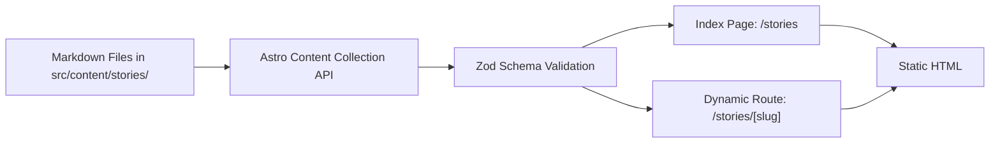

***
title: "feat: User Stories Section"
status: completed
created: 2026-07-16
updated: 2026-07-16
type: feat
depth: medium
owner: Core Team
labels: [frontend, content, astro]
***

# User Stories Section

## Summary

A new "Stories" section to feature personal accounts from buyers who have faced dealership scams or avoided them using the PDI checklist. This will start by extracting the author's own origin story into its own dedicated article, establishing a scalable foundation for future user-submitted stories.

***

## Problem Frame

### Current state
- The author's personal story is currently embedded within the `about-us.astro` page.
- There is no scalable infrastructure to add, organize, and display multiple stories from different users.
- The site currently lacks a community-driven narrative area.

### User pain
- New users visiting the site may not fully grasp the real-world risks of skipping a PDI without reading relatable, real-life examples.
- Users who have their own stories of dealership malpractice currently have no platform or structured format to share them on the site.

### Why now
- The project is establishing its core MPA structure. Implementing an Astro Content Collection for stories now prevents the `About Us` page from becoming bloated and sets up a clean, markdown-driven workflow for future content.

***

## Goals

- Establish an Astro Content Collection for "stories" to manage content via Markdown.
- Create a dedicated `/stories` index page to list all available stories.
- Create a dynamic route `/stories/[slug]` to render individual stories.
- Port the existing `why this.md` content into the first official story: "My Story".
- Update the site header and footer to link to the new Stories section.

## Non-goals

- Building a fully automated user-submission portal with backend databases (users will submit via email or PR for now).
- Complex filtering, pagination, or tagging systems (can be deferred until the collection grows large).
- Comment sections or user accounts.

***

## Requirements

- **R1.** Stories must be authored in Markdown (`.md` or `.mdx`) for easy editing and contribution.
- **R2.** Each story must have frontmatter metadata (title, author, date, excerpt).
- **R3.** The `/stories` page must list all stories in reverse chronological order.
- **R4.** The individual story pages must use the main site layout and match the design aesthetic (typography, spacing).
- **R5.** The inaugural story must be the author's experience from `why this.md`.
- **R6.** Navigation links to `/stories` must be present in the Header (desktop nav) and Footer.

***

## Success Criteria

- The `/stories` route successfully lists the inaugural story.
- Clicking the story navigates to `/stories/my-story` and renders the markdown content cleanly.
- The `about-us.astro` page can optionally link out to this story instead of hosting the full text.
- Lighthouse SEO score remains optimal due to the static generation of the MPA routes.

***

## Key Technical Decisions

- **Astro Content Collections** — We will use Astro's native content collections (`src/content/`) with Zod schema validation instead of raw markdown imports. This provides type safety for frontmatter and easier querying for the index page.
- **Static Generation** — Story pages will be statically generated at build time (`getStaticPaths`) for maximum performance and SEO.

***

## Alternatives Considered

### Option A — Hardcoded Astro Pages
- Pros: Simple to set up initially (`src/pages/stories/my-story.astro`).
- Cons: Does not scale well when we have 10+ stories. Harder to generate a dynamic index page without duplicating metadata.
- Rejected because: Astro Content Collections are explicitly designed for this use case and provide a vastly superior developer experience.

***

## High-Level Design

### Data flow



### Core model

```ts
// src/content/config.ts
import { defineCollection, z } from 'astro:content';

const storiesCollection = defineCollection({
  type: 'content',
  schema: z.object({
    title: string(),
    author: string(),
    date: z.date(),
    excerpt: string().optional(),
    featured: z.boolean().default(false),
  }),
});

export const collections = {
  'stories': storiesCollection,
};
```

### Component / module architecture

```text
src/
├── components/
│   └── common/ (Header, Footer updates)
├── content/
│   ├── config.ts (New)
│   └── stories/
│       └── my-story.md (New - from why this.md)
└── pages/
    └── stories/
        ├── index.astro (New)
        └── [slug].astro (New)
```

***

## UX Behavior

### Default
- Visiting `/stories` displays a grid or list of cards. Each card shows the story title, author, date, and excerpt.
- Clicking a card navigates to the full article.

### Empty / edge states
- If no stories exist, the `/stories` page should show a friendly empty state: "No stories yet. Have one to share? Contact us."

***

## Scope Boundaries

### In scope
- Setting up the Content Collection.
- Creating the index and individual story pages.
- Migrating the author's story.
- Updating site navigation.

### Deferred
- Rich media embedding (images/videos inside stories).
- Author avatars and bio blocks.
- Pagination for the stories index.

### Out of scope
- Database-driven user submissions.

***

## Implementation Units

### U1. Setup Content Collections & First Story

**Goal:** Establish the schema and write the first markdown file.  
**Requirements:** R1, R2, R5  
**Dependencies:** None

**Files:**
- `src/content/config.ts` (new)
- `src/content/stories/my-story.md` (new)

**Approach:**
1. Create the `src/content` directory.
2. Define the Zod schema in `config.ts` for a `stories` collection.
3. Create `my-story.md` using the text from `why this.md`, adding appropriate YAML frontmatter.

***

### U2. Create Stories Pages

**Goal:** Build the UI to list and render the stories.  
**Requirements:** R3, R4  
**Dependencies:** U1

**Files:**
- `src/pages/stories/index.astro` (new)
- `src/pages/stories/[slug].astro` (new)

**Approach:**
1. In `index.astro`, use `getCollection('stories')` to fetch all entries, sort by date, and map them to UI cards.
2. In `[slug].astro`, export `getStaticPaths` mapping over the collection to generate routes. Use `<Content />` to render the markdown body.
3. Apply standard page wrappers (e.g., `<Layout>`) and typography classes to style the markdown output.

***

### U3. Update Navigation

**Goal:** Make the new section discoverable.  
**Requirements:** R6  
**Dependencies:** U2

**Files:**
- `src/components/common/Header.tsx` (modify)
- `src/components/common/Footer.tsx` (modify)

**Approach:**
1. Add a "Stories" link to the desktop nav in `Header.tsx`.
2. Add a "Stories" link to the link cluster in `Footer.tsx`.

***

## Testing Strategy

### Unit
- Verify Zod schema strictly enforces required frontmatter fields (Title, Author, Date).

### Integration
- Verify `getStaticPaths` successfully generates HTML for `my-story.md`.
- Verify clicking the "Stories" link in the header correctly navigates to the index, and clicking the article navigates to the slug.

### Manual QA
- Review the typography of the rendered markdown to ensure headings, paragraphs, and lists inherit the site's design system (e.g., `body-md`, `title-md`).

***

## Performance Considerations

- Negligible impact. Astro statically generates these pages at build time. The markdown is compiled to raw HTML, resulting in zero additional client-side JavaScript.

***

## Accessibility

- Ensure story list cards use semantic HTML (e.g., `<ul>` and `<li>`, proper heading hierarchy).
- Ensure links within the markdown content have clear affordances and high contrast.

***

## Persistence & Configuration

- Content is persisted strictly as static Markdown files in the Git repository. No external CMS or database configuration is required at this stage.

***

## Telemetry / Debugging

- Rely on Astro's build-time console warnings if frontmatter validation fails or if `getStaticPaths` encounters errors.

***

## Rollout Plan

### Phase 1
- Implement U1, U2, and U3 in a single PR.
- Deploy to Vercel/production environment. The site is statically built, so the pages go live immediately.

***

## Risks & Mitigations

| Risk | Mitigation |
|------|------------|
| Unstyled Markdown Output | Wrap the `<Content />` component in a `div` with a specific prose class (or apply global CSS) to ensure lists, bold text, and paragraphs match the site's existing CSS variables. |

***

## Open Questions

- Should we include a Call To Action (CTA) at the bottom of the `/stories` index asking users to email their own stories to us?
- Do we want to keep the duplicate story text in `about-us.astro`, or replace it with a shorter summary that links to the new `/stories/my-story` page? (Recommendation: Shorten the About Us page and link out to the full story).

***

## Sources / References

- [Astro Content Collections Documentation](https://docs.astro.build/en/guides/content-collections/)
- `e:\00_HeadQuaters\50_Projects\PDI\why this.md` (Source material for inaugural story)
